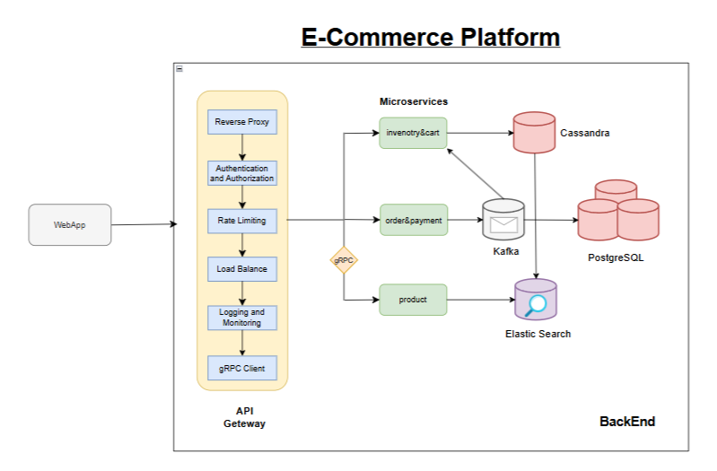
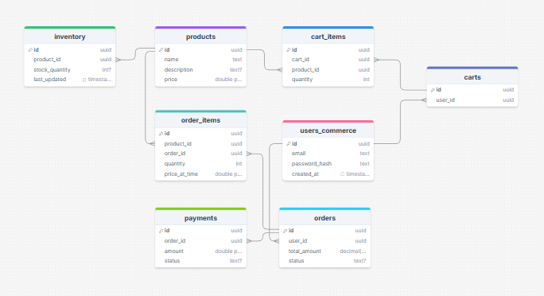
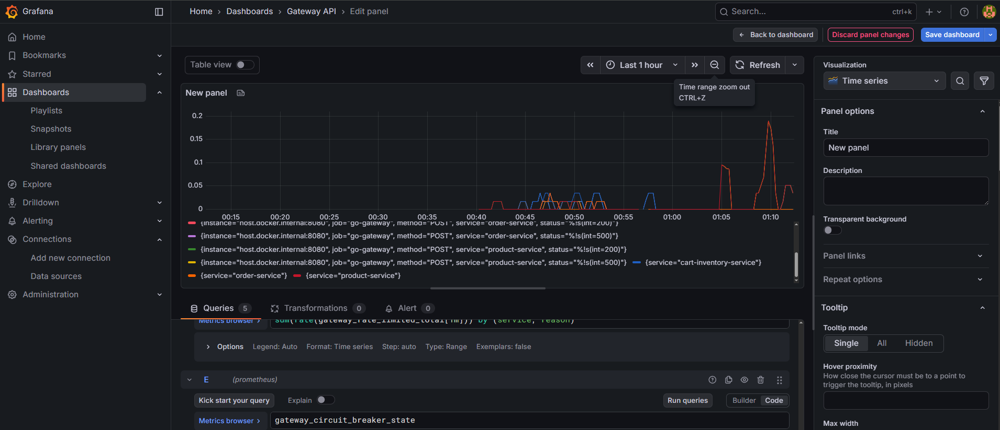

# Scalable Microservices E-commerce Platform

A production-ready, distributed e-commerce system built with Go and Microservices architecture.
This platform is designed for high scalability, fault tolerance, and real-time data processing, 
utilizing a modern tech stack and cloud-native patterns.

> Project Inspiration: This project is based on the Fitness [Scalable E-Commerce Platform](https://roadmap.sh/projects/scalable-ecommerce-platform) project idea from roadmap.sh

---


---

## Features

### Core Functionality
- **Dynamic Product Catalog** - Real-time search and filtering powered by Elasticsearch (supporting fuzzy search and high-speed indexing).
- **High-Availability Shopping Cart** - Managed via Redis for sub-millisecond latency and backed by Apache Cassandra for persistent, distributed storage.
- **Event-Driven Order Management** - Fully decoupled order processing using Apache Kafka to handle high-concurrency payment and checkout flows.
- **Automated Inventory Sync** - Real-time stock updates across multiple databases (PostgreSQL, Cassandra, ES) using an asynchronous worker pattern.

### Technical Features
#### Distributed System Architecture
- **Microservices Decoupling** - Independent services communicating via RESTful APIs and Asynchronous Message Passing (Event-Driven Architecture).
- **Event Sourcing with Kafka** - Real-time synchronization between PostgreSQL (Source of Truth) and Elasticsearch (Search Engine) to ensure data consistency without tight coupling.
- **Database Per Service Pattern** - Optimized storage strategy using Polyglot Persistence (PostgreSQL for ACID transactions, Cassandra for high-write availability, and Redis for low-latency caching).

#### Advanced API Gateway Patterns
- **Resilience Engineering** - Implementation of the Circuit Breaker pattern to prevent cascading failures when downstream services are unhealthy.
- **Traffic Management** - Token Bucket Rate Limiting to protect against API abuse and ensure fair resource distribution.
- **Dynamic Routing** - Centralized entry point for all internal services with automated request forwarding and error handling.

#### Observability & Tracing
- **Distributed Request Tracing** - End-to-end monitoring using Correlation IDs that propagate from the Gateway through Kafka Workers to the final database write.
- **Structured Logging** - High-performance, leveled logging with Zap for efficient log parsing and debugging.
- **Real-time Metrics Pipeline** - Custom Prometheus exporters visualizing system health, HTTP latencies, and circuit breaker states on Grafana Dashboards.

#### DevOps & Infrastructure
- **Containerization** - Fully dockerized environment with Docker Compose for easy local development and environment parity.
- **Health Checks & Self-Healing** - Automated service discovery and container restart policies for high uptime.
- **Infrastructure Spin-up:** Automated deployment of 7+ containers (Postgres, Kafka, Zookeeper, Redis, Cassandra, ES).
- **Health Verification:** Smart wait-scripts ensure all databases are ready before tests start.
- **Schema Auto-Migration:** Automated SQL injection for both Relational and NoSQL databases.
- **Race Detection:** Tests are executed to catch concurrency issues in the Go microservices.

### Advanced Features
- **gRPC Integration** - Internal communication between Gateway and Product Service is optimized using gRPC, reducing latency and payload size by up to 80% compared to JSON.
- **Resilient Proxying** - The Gateway wraps gRPC calls with a Circuit Breaker. If the gRPC backend fails, the Gateway automatically trips to Open state to prevent cascading failures.
- **Contract-First Development** - Shared .proto files ensure that the Gateway and Microservices are always in sync regarding data structures.

#### Continuous Integration & Quality Assurance
- **Automated CI Pipeline** - GitHub Actions workflow that triggers on every push/PR to validate code integrity via `go build` and `go test`.
- **Dependency Tracking** - Automated `go.sum` validation ensuring secure and reproducible builds across different environments.

### End-to-End (E2E) Testing
We have implemented a comprehensive E2E suite (`test/e2e_test.go`) that simulates a complete user journey:
1. **Product Creation:** Verifies gRPC/REST connectivity.
2. **Inventory Management:** Sets stock levels in PostgreSQL.
3. **Cart Operations:** Persists data in Redis/Cassandra.
4. **Order Lifecycle:** Creates a 'pending' order.
5. **Asynchronous Payment:** Processes payment via Kafka event-streaming.
6. **Data Consistency:** Verifies inventory decrement and Elasticsearch synchronization.

---

## Architecture



This project follows a clean and structured architecture for maintainability and scalability.
```
.
├── .github/workflows/       # CI/CD Orchestration
│   ├── main.yml             # Unit Tests & Build pipeline
│   └── E2e.yml              # Full Stack E2E Integration pipeline (The "Heavy" Test)
├── backend1/                # Cart & Inventory Service (Cassandra & Redis)
│   ├── api/                 # HTTP Handlers for cart operations & inventory logic
│   ├── models/              # Data structures for Cart and Inventory entities
│   ├── Dockerfile1          # Specialized build for Service 1
│   ├── main.go              # Entry point for Service 1 (Port 8081)
│   └── schema_cassandra.sql # Database schema specifically for Cassandra
├── backend2/                # Product Service (Elasticsearch Sync)
│   ├── api/                 # Handlers for Product CRUD & Search logic
│   │   └── sync_worker.go   # Kafka consumer that syncs products to Elasticsearch
│   ├── models/              # Product data models
│   ├── Dockerfile2          # Specialized build for Service 2
│   └── main.go              # Entry point for Service 2 (Port 8082)
├── backend3/                # Order & Payment Service (Kafka & PostgreSQL)
│   ├── api/                 # Handlers for Checkout and Payment processing
│   │   └── sync_worker.go   # Worker for finalizing orders and cleaning up cache
│   ├── models/              # Order and Payment data models
│   ├── Dockerfile3          # Specialized build for Service 3
│   └── main.go              # Entry point for Service 3 (Port 8083)
├── config/                  # Shared configuration management
│   ├── config.go            # Logic for loading environments and database connections
│   ├── config-localHost     # Static configuration values (DB credentials, etc.) for localhost use
│   └── config.json          # Static configuration values (DB credentials, etc.) for docker use
├── database/                # Global database management
│   ├── schema.sql           # Main PostgreSQL schema (Source of Truth)
│   └── schema-changes.sql   # Migration scripts and history
├── images/ 
├── test/ 
│   └── e2e_test.go         # E2E test suite simulating real user interactions across the entire platform
├── test/ 
│   └── e2e_test.go          # E2E test suite simulating real user interactions
├── config.yaml              # Gateway & Middleware configuration (Routes, Rate Limits)
├── docker-compose.yml       # Infrastructure orchestration (Kafka, DBs, ES, Redis)
├── gateway.go               # The API Gateway (Reverse Proxy, Circuit Breaker, Auth)
├── prometheus.yaml          # Metrics scraping configuration for Prometheus
├── go.mod                   # Go dependencies and module definition
└── README.md                # Project documentation and architecture overview
```

---

## Database Schema

*(Schema files included in `/database` folder with schema & schema changes SQL.)*



---

## Technology Stack
- **Language:** Go (1.24+)
- **Framework:** Gin Web Framework
- **Zap Logger:** High-performance, structured logging for enterprise-grade observability.
- **Database:** PostgreQL-based relational DB
- **Apache Cassandra:** Distributed NoSQL database for the shopping cart, optimized for high-write availability.
- **Redis:** In-memory data store for sub-millisecond session management and order caching.
- **Elasticsearch:** Distributed search engine providing fuzzy search and real-time product discovery.
- **Apache Kafka:** Distributed event streaming platform used for asynchronous communication and database synchronization.
- **Prometheus:** Systems monitoring and alerting toolkit for collecting real-time metrics.
- **Grafana:** Visualization platform for monitoring service health, Circuit Breaker states, and traffic patterns.
- **Distributed Tracing:** Custom implementation using Correlation Ids across HTTP headers and Kafka metadata.
- **Docker & Docker Compose:** Containerization for environment parity and simplified local orchestration.
- **API Gateway:** Custom-built gateway featuring Rate Limiting (Token Bucket) and Circuit Breaker patterns.
- **Communication:** gRPC with Protocol Buffers (Internal East-West traffic).
- **Protocols:** HTTP/2 for inter-service communication, JSON/REST for Client-Gateway.
- **Schema:** Protobuf definitions for strict service contracts.

---

## Getting Started

### Prerequisites
- Go **1.24+**
- Docker & Docker Compose: (Crucial) Used to orchestrate all infrastructure components (Databases, Kafka, Monitoring).
- PostgreSQL **12+**: Main relational database for order and user management.
- Apache Cassandra: NoSQL storage for the shopping cart and inventory.
- Redis **6+**: High-speed caching and session management.
- Apache Kafka: Distributed event streaming for inter-service communication.
- Elasticsearch **8+**: Search engine for the product catalog.
- Prometheus & Grafana: For metrics collection and visualization.

---

## Installation & Setup

### 1. The "One-Command" Start (Recommended)
The entire platform, including all 3 microservices, the API Gateway, and the full infrastructure stack, is containerized.

```bash
# Clone the repository
git clone [https://github.com/vrstelios/ecommercePlatform.git](https://github.com/vrstelios/ecommercePlatform.git)
cd ecommercePlatform

# Launch all services and infrastructure
docker compose -f docker-compose.monitoring.yml up --build
```

### 2. Database Schema Initialization
Once the containers are up and running, you need to initialize the database schemas:
For Cassandra (Cart & Inventory):
```bash
docker exec -it cassandra cqlsh -f backend1/schema_cassandra.sql
```
For PostgreSQL (Orders & Payments):
```bash
docker exec -i postgres psql -U postgres -d postgres < database/schema-shanges.sql
```

Set up the PostgreSQL and Cassandra tables for the Docker images you’ve built

### 3. Running E2E Tests Locally
If you have the infrastructure running via Docker, you can execute the full test suite:
```bash
# Run all tests including the E2E suite
go test -v ./test/e2e_test.go
```

## API Endpoints
All requests should be directed to the API Gateway at `http://localhost:8080`.

# API Workflow 
- **Method:** `POST`
- **URL:** `http://localhost:8080/products`
- **Body:**
```json
{
  "name": "Laptop",
  "price": 1200.00,
  "description": "High performance laptop MacookPro"
}
```

- **Method:** `GET`
- **URL:** `http://localhost:8080/product/products/v2?search=Laptop`


- **Method:** `POST`
- **URL:** `http://localhost:8080/api/inventory`
- **Body:**
```json
{
    "productId": "a1b2c3d4-e5f6-7890-abcd-ef1234567890",
    "stock": 100
}
```

- **Method:** `POST`
- **URL:** `http://localhost:8080/api/cart/items`
- **Body:**
```json
{
   "cartId": "7f7703a6-7847-4610-9104-2a902287e857",
   "productId": "a1b2c3d4-e5f6-7890-abcd-ef1234567890",
   "quantity": 2
}
```

- **Method:** `POST`
- **URL:** `http://localhost:8080/api/orders/create/:cartId`
- **Result:**
```json
{
    "order_id": "66279068-c4c5-4545-ae30-8a5bfe9e72d3",
    "status": "pending"
}
```

- **Method:** `POST`
- **URL:** `http://localhost:8080/orders/:cartId/pay`
- **Body:**
```json
{
  "orderId": "b3d78c67-6143-4ed0-8771-fe598492c5a6",
  "userId": "dd376484-ae89-4f65-94b7-c0e06f156ab1",
  "amount": 250.50,
  "paymentMethod": "credit_card"
}
```


## Monitoring & Observability
- **Grafana:** `http://localhost:3000` (Dashboards for Circuit Breaker & Latency)
- **Prometheus:** `http://localhost:9090` (Raw metrics & Targets)
- **Elasticsearch Stats:** `http://localhost:9200`

# Required Headers
To successfully interact with the API, the following headers are required (enforced by Gateway middleware):
- X-API-KEY: Must be a valid key defined in config.yaml (e.g., abc-123).
- X-Correlation-Id: (Optional) Provide a custom Id to trace your request across microservices. If omitted, the Gateway will generate one automatically.

---

# Resilience Test: Circuit Breaker in Action


Dashboard (Queries)\
A. Panel: Requests per Service (Time Series): `sum(rate(http_requests_counter[1m])) by (service)`\
B. Panel: Error Rate (Pie Chart ή Bar Gauge): `sum(rate(http_requests_counter{status=~"5.."}[5m])) by (service)`\
C. Panel: Rate Limiting Events: `sum(rate(gateway_rate_limited_total[1m])) by (service, reason)`\
D. Panel: Circuit Breaker State: `gateway_circuit_breaker_state`

The screenshot below demonstrates a real-world failure scenario:
1. Healthy State: Services responding normally (200 OK).
2. Service Failure: Elasticsearch was manually stopped. The Gateway detected consecutive 500 errors.
3. Circuit Open: The Circuit Breaker tripped to Open state, immediately rejecting requests to prevent backend saturation.
4. Recovery: Once Elasticsearch was back online, the Gateway transitioned to Half-Open, verified service health, and successfully returned to Closed (Normal) state.

---

### Contributing
- Fork the repo
- Create a feature branch (git checkout -b feature/amazing-feature)
- Commit your changes (git commit -m 'Add some amazing feature')
- Push to the branch (git push origin feature/amazing-feature)
- Open a Pull Request

### Author
[DoctorVerRossi](https://github.com/vrstelios)

---

If you find this project helpful, please give it a star on GitHub!
